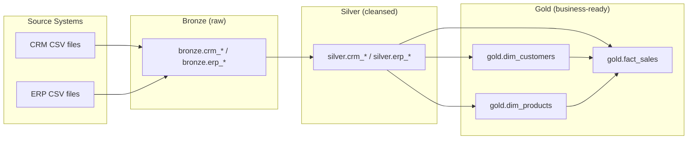

# SQL Data Warehouse Project

A Microsoft SQL Server data warehouse built using the **Medallion
Architecture** (Bronze → Silver → Gold), taking raw CRM and ERP CSV exports
through cleansing and standardization into a business-ready dimensional
model for reporting and analytics.

## Architecture



See [`docs/data_architecture.md`](docs/data_architecture.md) for the full
write-up.

## Repository Structure

```
.
├── docs/
│   ├── data_architecture.md   # Layer-by-layer architecture overview
│   ├── data_catalog.md        # Column-level documentation of Gold views
│   ├── data_flow.md           # Source-to-target column lineage
│   └── naming_conventions.md  # Schema/table/column naming rules
├── scripts/
│   ├── init_database.sql          # Creates the database and bronze/silver/gold schemas
│   ├── create_silver_tables.sql   # Creates the Silver layer tables
│   ├── load_bronze.sql            # bronze.load_bronze: BULK INSERT from source CSVs
│   ├── load_silver.sql            # silver.load_silver: cleanses Bronze into Silver
│   ├── create_gold_views.sql      # Creates the Gold layer dimensional views
│   ├── fn_ProperCase.sql          # Scalar function used to title-case free text
│   ├── quality_checks_silver.sql  # Validation checks against the Silver layer
│   └── quality_checks_gold.sql    # Validation checks against the Gold layer
└── README.md
```

## Requirements

- Microsoft SQL Server (developed and tested in SSMS)
- Source CSV files for the CRM and ERP systems, referenced by
  `load_bronze.sql`

## Setup

Run the scripts in order:

1. **`init_database.sql`** — creates the `data_warehouse` database and the
   `bronze`, `silver`, and `gold` schemas.
   > ⚠️ This drops the `data_warehouse` database if it already exists. Back
   up anything you need before running it.
2. **`fn_ProperCase.sql`** — creates the `dbo.fn_ProperCase` helper function,
   used later during Silver layer cleansing.
3. **`create_silver_tables.sql`** — creates the Silver layer table
   structures.
4. **`load_bronze.sql`** — creates and runs `bronze.load_bronze`.
   > Update the hardcoded CSV file paths in this script to match your
   environment before running it.
   ```sql
   EXEC bronze.load_bronze;
   ```
5. **`load_silver.sql`** — creates and runs `silver.load_silver`.
   ```sql
   EXEC silver.load_silver;
   ```
6. **`create_gold_views.sql`** — creates the Gold layer views.
7. **`quality_checks_silver.sql`** / **`quality_checks_gold.sql`** — run
   after each load to confirm the data looks right; every check should
   return zero rows.

## Data Model

| Layer  | Objects                                                        | Purpose                                   |
|--------|-----------------------------------------------------------------|---------------------------------------------|
| Bronze | `crm_cust_info`, `crm_prd_info`, `crm_sales_details`, `erp_CUST_AZ12`, `erp_LOC_A101`, `erp_PX_CAT_G1V2` | Raw, as-ingested source data |
| Silver | Same tables, `silver` schema                                    | Cleansed, standardized, deduplicated data |
| Gold   | `dim_customers`, `dim_products`, `fact_sales`                    | Business-ready dimensional model          |

Full column-level documentation is in
[`docs/data_catalog.md`](docs/data_catalog.md).

## Naming Conventions

See [`docs/naming_conventions.md`](docs/naming_conventions.md) for the
conventions this project follows for schemas, tables, and columns.
