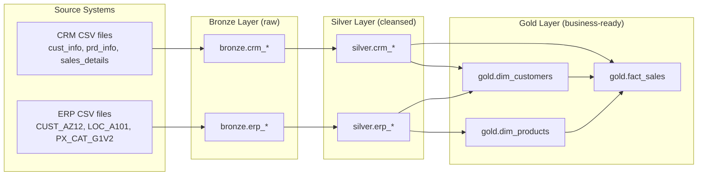

# Data Architecture

This project follows the **Medallion Architecture**, organizing data into three
layers — Bronze, Silver, and Gold — within a single `data_warehouse` database
on Microsoft SQL Server.

## Overview

## Layers

### Bronze — Raw Ingestion
- **Purpose:** land source data with no transformation, exactly as received.
- **Load method:** `bronze.load_bronze` stored procedure, using `BULK INSERT`
  from CSV files, with a `TRUNCATE` before each load.
- **Objects:** `bronze.crm_cust_info`, `bronze.crm_prd_info`,
  `bronze.crm_sales_details`, `bronze.erp_CUST_AZ12`, `bronze.erp_LOC_A101`,
  `bronze.erp_PX_CAT_G1V2`.

### Silver — Cleansed & Standardized
- **Purpose:** fix data quality issues from Bronze — trimming whitespace,
  standardizing coded values (e.g. gender, marital status, product line,
  country), deduplicating on business keys, validating dates, and
  recalculating inconsistent numeric fields.
- **Load method:** `silver.load_silver` stored procedure.
- **Objects:** mirrors the Bronze table names under the `silver` schema.
- **Supporting object:** `dbo.fn_ProperCase`, a scalar function used to
  title-case free-text values (e.g. country names) during cleansing.

### Gold — Business-Ready Model
- **Purpose:** expose a dimensional model for reporting and analytics.
- **Load method:** views (no physical load step); always reflect the current
  contents of Silver.
- **Objects:**
  - `gold.dim_customers` — customer dimension, combining CRM and ERP
    customer attributes, with a surrogate `customer_key`.
  - `gold.dim_products` — product dimension, current products only
    (historical product versions are excluded), with a surrogate
    `product_key`.
  - `gold.fact_sales` — sales transactions, linked to both dimensions via
    their surrogate keys.

## Data Quality
Two validation scripts support this pipeline:
- `quality_checks_silver.sql` — validates Silver layer cleansing rules
  (deduplication, standardized values, valid date ranges, sales
  consistency).
- `quality_checks_gold.sql` — validates the Gold dimensional model
  (duplicate surrogate keys, referential integrity between facts and
  dimensions).
