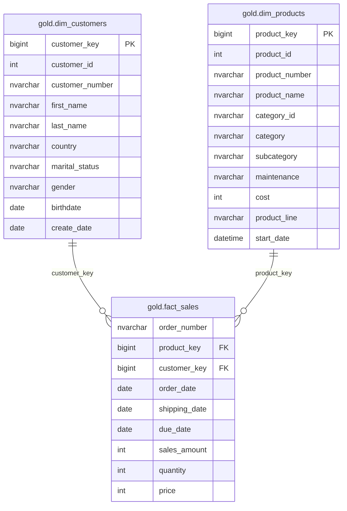
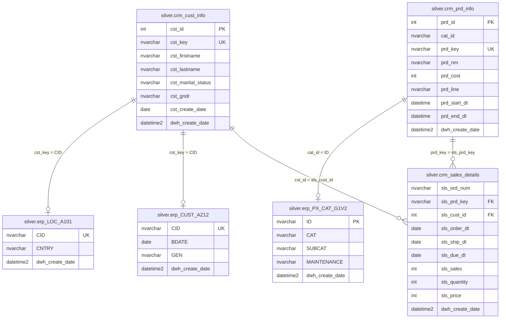
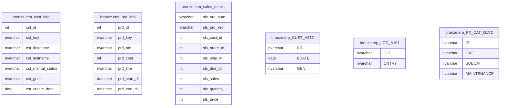
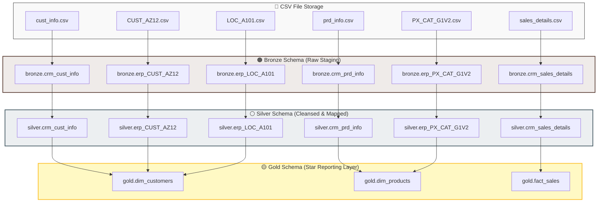

# 📊 Entity Relationship Diagram (ERD) & Lineage

This document visualizes the structural schemas, inter-table constraints, and end-to-end data pipelines across all three architectural layers of the data warehouse.

---

## 🟡 Gold Layer: Star Schema (Reporting)

The Gold layer transforms your data assets into a highly optimized, consumer-ready dimensional star schema composed of unified dimensions and a central transaction fact view.



### Relationships

| From Table | To Table | Type | Join Constraint Key |
| --- | --- | --- | --- |
| `gold.fact_sales` | `gold.dim_customers` | Many-to-One ($\infty \rightarrow 1$) | `customer_key` |
| `gold.fact_sales` | `gold.dim_products` | Many-to-One ($\infty \rightarrow 1$) | `product_key` |

---

## ⚪ Silver Layer: Cleansed Tables

The Silver layer acts as the standardization zone. Operational systems originating from different source landscapes (CRM and ERP) are cleanly separated, normalized, and mapped out via implicit lookup mappings.



### Relationships

| From Table | To Table | Type | Source Target Join Logic |
| --- | --- | --- | --- |
| `silver.crm_sales_details` | `silver.crm_cust_info` | Many-to-One | `sls_cust_id` $\rightarrow$ `cst_id` |
| `silver.crm_sales_details` | `silver.crm_prd_info` | Many-to-One | `sls_prd_key` $\rightarrow$ `prd_key` |
| `silver.crm_cust_info` | `silver.erp_CUST_AZ12` | One-to-Zero/One | `cst_key` $\rightarrow$ `CID` |
| `silver.crm_cust_info` | `silver.erp_LOC_A101` | One-to-Zero/One | `cst_key` $\rightarrow$ `CID` |
| `silver.crm_prd_info` | `silver.erp_PX_CAT_G1V2` | Many-to-One | `cat_id` $\rightarrow$ `ID` |

---

## 🟤 Bronze Layer: Raw Staging Tables

The Bronze layer ingests unstructured and raw transactional history directly from flat file systems. **No key constraints are actively enforced at this layer.** Table cross-references are purely structural and left intentionally decoupled until downstream cleaning.



> ⚠️ **Architecture Note:** Primary keys, foreign references, and semantic uniqueness do not exist inside the Bronze layer. Structural cleaning anomalies, math inaccuracies, whitespace adjustments, and invalid timelines are audited and managed during the **Bronze $\rightarrow$ Silver** stored procedure transitions.

---

## 🗺️ Complete Pipeline Data Lineage

This node map visualizes the sequential processing flow from raw operational system flat storage down to final business-intelligence ready entity definitions.



---

## 🛠️ Viewing Renderings inside GitHub

This technical blueprint leverages **Mermaid** declarative diagramming syntax. GitHub parses, renders, and creates active zoomable interactive vector graphics for these blocks automatically.

* **Local Offline Support:** To render these blueprints inside your local development workspace, install the extensions: `Markdown Preview Mermaid Support` inside your VS Code tool environments.

---

*Last Updated: July 2026*

```

```        int sls_price
    }

    bronze_erp_CUST_AZ12 {
        nvarchar CID
        date BDATE
        nvarchar GEN
    }

    bronze_erp_LOC_A101 {
        nvarchar CID
        nvarchar CNTRY
    }

    bronze_erp_PX_CAT_G1V2 {
        nvarchar ID
        nvarchar CAT
        nvarchar SUBCAT
        nvarchar MAINTENANCE
    }
```

> **Note:** No foreign keys exist in the Bronze layer. Data quality issues such as duplicates, missing values, invalid formats, and inconsistent codes are resolved during the **Bronze → Silver** transformation process.

---

# Full Data Lineage

```text
┌─────────────────────────────────────────────────────────────┐
│                        CSV SOURCES                          │
├───────────────────────┬─────────────────────────────────────┤
│      source_crm/      │            source_erp/              │
│  cust_info.csv        │  CUST_AZ12.csv                      │
│  prd_info.csv         │  LOC_A101.csv                       │
│  sales_details.csv    │  PX_CAT_G1V2.csv                    │
└──────────┬────────────┴────────────┬─────────────────────────┘
           │                         │
           ▼                         ▼
┌──────────────────────┐   ┌──────────────────────┐
│     BRONZE LAYER     │   │     BRONZE LAYER     │
│    (Raw CRM Data)    │   │    (Raw ERP Data)    │
│                      │   │                      │
│ crm_cust_info        │   │ erp_CUST_AZ12        │
│ crm_prd_info         │   │ erp_LOC_A101         │
│ crm_sales_details    │   │ erp_PX_CAT_G1V2      │
└──────────┬───────────┘   └──────────┬───────────┘
           │                          │
           └──────────────┬───────────┘
                          │
                          ▼
              ┌────────────────────────┐
              │      SILVER LAYER      │
              │   (Cleansed Tables)    │
              │                        │
              │ crm_cust_info          │
              │ crm_prd_info           │
              │ crm_sales_details      │
              │ erp_CUST_AZ12          │
              │ erp_LOC_A101           │
              │ erp_PX_CAT_G1V2        │
              └────────────┬───────────┘
                           │
                           ▼
              ┌────────────────────────┐
              │       GOLD LAYER       │
              │     (Star Schema)      │
              │                        │
              │ dim_customers          │
              │ dim_products           │
              │ fact_sales             │
              └────────────────────────┘
```
